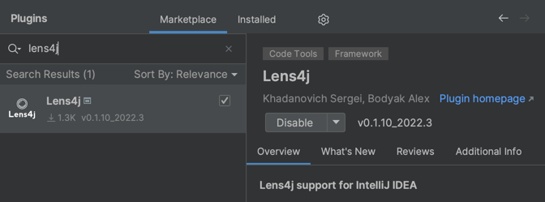

# Lens4j support for IntelliJ IDEA

IntelliJ plugin to provide some convenient features for projects which use
[Lens4j](https://github.com/kh-bd/lens4j) library.

## What is lens4j?

Lens is an abstraction which has ability to get a property value from any depth
and set a property value to any depth as well.
To read more about lens, look at it's [home page](https://github.com/kh-bd/lens4j)

## How to install plugin

It's intelliJ plugin, so to install it go to `Preferenses -> Plugins -> Marketplace`.
Type in lens4j. It should be there.

If you cannot find plugin in marketplace, it can mean your IntelliJ version is not supported.
Try to update to the latest IntelliJ version.

## Main features:

- Syntax highlighting:
  - Highlighting properties in `@Lens.path`
  - Explicit factory class name in `@GenLenses.factoryName` annotation
  - Explicit lens name in `@Lens.lensName` annotation
- Go To declarations: path properties, factory classes and lenses
- Code completion in `@Lens.path`
- `Regenerate factory` action on any class with `@GenLenses` annotation is available.